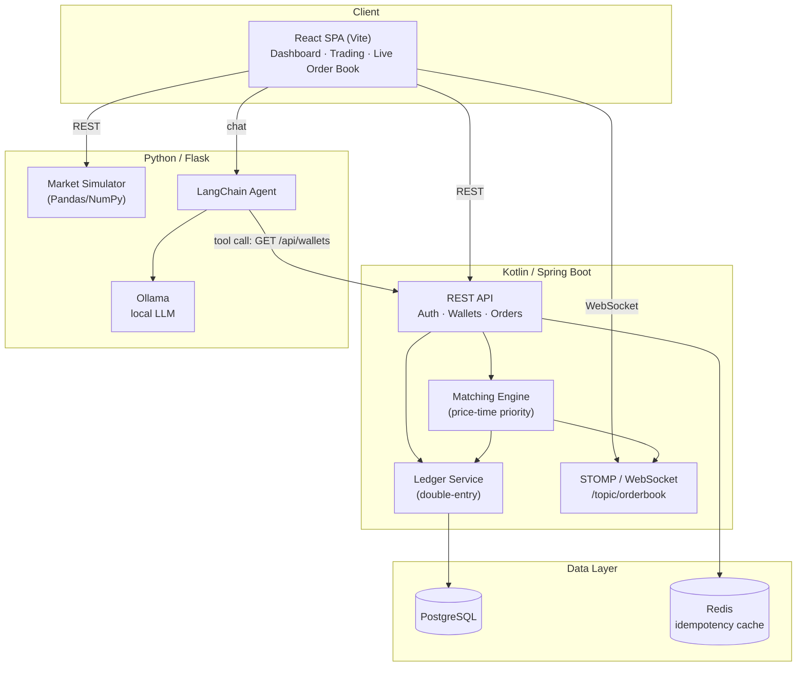

# OpenEx 3.0

**A simulated crypto exchange & AI trading terminal** — built as a 100% open-source microservices system with a double-entry ledger, real-time order book, and a local (air-gapped) LLM trading assistant.


---

## Table of Contents

- [Overview](#overview)
- [Architecture](#architecture)
- [Tech Stack](#tech-stack)
- [Core Engineering Guarantees](#core-engineering-guarantees)
- [Getting Started](#getting-started)
- [Services](#services)
- [API Reference](#api-reference)
- [Testing](#testing)
- [Project Structure](#project-structure)
- [Screenshots](#screenshots)
- [Roadmap / Known Limitations](#roadmap--known-limitations)
- [License](#license)

---

## Overview

OpenEx 3.0 simulates a crypto exchange end-to-end:

- Users authenticate, deposit simulated funds, and place limit/market orders.
- An in-memory matching engine executes trades using price-time priority.
- Every trade is recorded as a **double-entry ledger** transaction (never raw balance math).
- A React terminal streams the live order book over WebSockets.
- A Python/Flask microservice generates simulated market data and powers an **agentic AI assistant** (via LangChain + Ollama) that can answer questions about a user's real wallet balance by calling the exchange API as a tool.

The entire stack boots from a cold start with a single `docker-compose up`.

## Architecture



- **Kotlin/Spring Boot** owns the source of truth: accounts, ledger, orders, matching engine, JWT auth.
- **React** is a pure client of the REST API and the STOMP/WebSocket order-book feed.
- **Python/Flask** owns market simulation and the AI assistant, and calls back into the Kotlin API as a LangChain tool to fetch live wallet data — it never touches the database directly.

## Tech Stack

| Layer | Technology |
|---|---|
| Backend | Kotlin, Spring Boot, Spring Security (JWT), Spring Data JPA, Spring WebSocket (STOMP) |
| Database | PostgreSQL, Flyway/Liquibase migrations |
| Cache / Idempotency store | Redis |
| Frontend | React (Vite), React Router, Zustand/Context, Chart.js |
| Analytics service | Python, Flask, Pandas, NumPy |
| AI | Ollama (local LLM, e.g. Llama 3 / Mistral), LangChain agent + tool calling |
| CI/CD | GitHub Actions |
| Orchestration | Docker Compose with healthchecks |

## Core Engineering Guarantees

- **Double-entry accounting** — every transaction writes balancing `CREDIT` and `DEBIT` rows to `ledger_entries`; account balances are derived, never mutated directly.
- **API idempotency** — order creation requires an `Idempotency-Key` header; a repeated key returns the original cached response instead of creating a duplicate order.
- **Transactional integrity** — ledger writes are wrapped in `@Transactional` boundaries and roll back completely on failure.
- **Container orchestration** — Postgres and Redis expose Docker healthchecks; dependent services use `depends_on: condition: service_healthy` so nothing starts before its dependencies are ready.
- **Air-gapped GenAI** — the AI assistant runs entirely against a local Ollama model; no external LLM API is called.

## Getting Started

### Prerequisites

- Docker & Docker Compose
- ~8GB free RAM (for Ollama + the rest of the stack)

### Run everything

```bash
git clone https://github.com/bentsa/openex.git
cd openex
docker-compose up
```

This starts, in order (via healthchecks):

1. PostgreSQL and Redis
2. The Kotlin/Spring Boot API (`:8080`)
3. The Python/Flask analytics + AI service (`:5000`)
4. The React frontend (`:5173` in dev, or served statically in prod)
5. Ollama, pulling the configured model on first run

Once up, open the frontend URL, register a user, deposit simulated funds from the wallet dashboard, and start trading.

### Environment variables

| Variable | Service | Purpose |
|---|---|---|
| `JWT_SECRET` | Kotlin | Signing key for stateless JWTs |
| `SPRING_DATASOURCE_URL` | Kotlin | PostgreSQL connection string |
| `SPRING_REDIS_HOST` | Kotlin | Redis host for idempotency cache |
| `OLLAMA_HOST` | Flask | Ollama endpoint for LangChain |
| `KOTLIN_API_BASE_URL` | Flask | Base URL the AI agent tool calls for wallet lookups |

## Services

### `kotlin-api/`
Spring Boot service exposing REST + WebSocket endpoints, the ledger, and the matching engine.

### `frontend/`
Vite/React SPA: login/register, wallet dashboard, order entry forms, live order book, price charts, and the AI chat widget.

### `python-service/`
Flask app that:
- Simulates a market price feed (random walk with drift) and moving averages.
- Hosts a LangChain agent backed by a local Ollama model.
- Registers a tool that calls the Kotlin `GET /api/wallets` endpoint so the assistant can answer balance questions with real data.

## API Reference

### Auth
| Method | Endpoint | Description |
|---|---|---|
| `POST` | `/api/auth/register` | Create a user |
| `POST` | `/api/auth/login` | Returns a JWT |

### Wallets
| Method | Endpoint | Description |
|---|---|---|
| `POST` | `/api/wallets/deposit` | Faucet — credits simulated funds via the ledger |
| `GET` | `/api/wallets` | Returns current balances (derived from ledger entries) |

### Orders
| Method | Endpoint | Description |
|---|---|---|
| `POST` | `/api/orders` | Place a limit or market order. Requires `Idempotency-Key` header |
| `GET` | `/api/orders` | List a user's orders |

### Market data / AI (Flask)
| Method | Endpoint | Description |
|---|---|---|
| `GET` | `/api/market/ticks` | Historical + current simulated price data |
| `POST` | `/api/chat` | AI trading assistant chat endpoint |

### WebSocket
| Destination | Payload |
|---|---|
| `/topic/orderbook` | Live order book snapshot, broadcast on every matching engine state change |

## Testing

```bash
# Backend unit + integration tests
cd kotlin-api && ./gradlew test

# Frontend
cd frontend && npm test

# Python service
cd python-service && pytest
```

Key test coverage:
- Ledger entries always sum to zero; failed transactions roll back entirely.
- Duplicate `Idempotency-Key` submissions return the cached response, not a new order.
- Concurrent order matching (10+ simultaneous orders) resolves correctly and updates the ledger accurately.

CI runs backend tests and linting on every pull request via GitHub Actions; PRs cannot merge on a failing pipeline.

## Project Structure

```
openex/
├── kotlin-api/              # Spring Boot backend
│   ├── src/main/kotlin/...
│   └── src/main/resources/db/migration/   # Flyway/Liquibase
├── frontend/                # React (Vite) SPA
│   └── src/
├── python-service/          # Flask analytics + AI agent
│   └── app/
├── docker-compose.yml
└── README.md
```

## Screenshots

> _Add screenshots of the dashboard, live order book, and AI chat widget here._

## Roadmap / Known Limitations

- Matching engine is in-memory and single-node (no persistence of the book itself across restarts, only executed trades).
- Market data is simulated (random walk), not sourced from a real exchange feed.
- Ollama model quality depends on the local model pulled (default: Llama 3).

## License

MIT — see [LICENSE](LICENSE).
